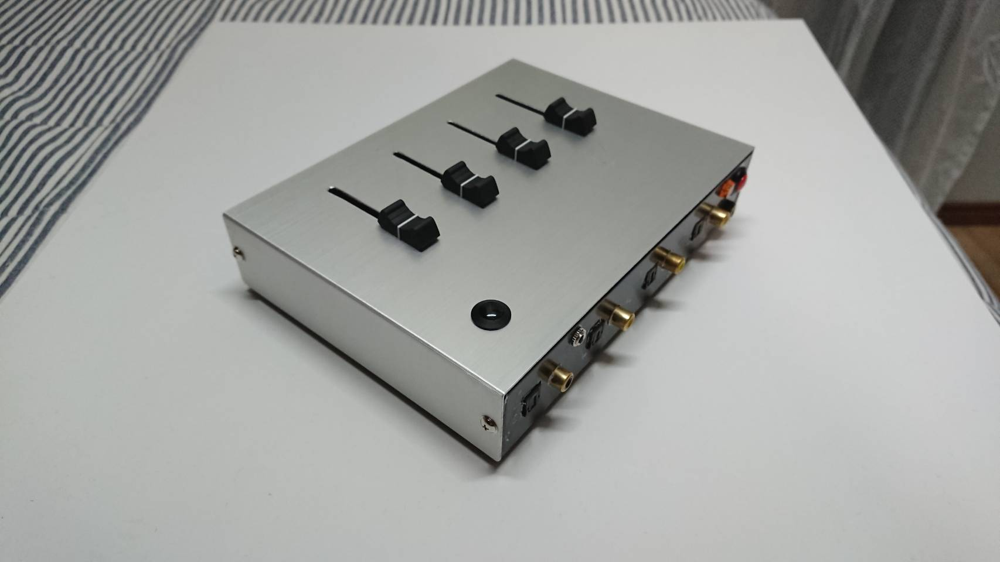

# takAVmixer

光オーディオミキサー

## DEMO

  

## Features

概要説明：[LINK](https://github.com/CC-WO/takAVmixer/blob/master/takAVmixer.md)

## Requirement

None

## Installation

None

## Usage

None

## Note

製作物のアウトプット報告のため簡単な説明のみ

## Author

- Auther:CCWO
- E-mail:cc.ccwo.cc@gmail.com

## License

"takAVmixer" is under [MIT license](https://en.wikipedia.org/wiki/MIT_License).

"takAVmixer" is Confidential.
