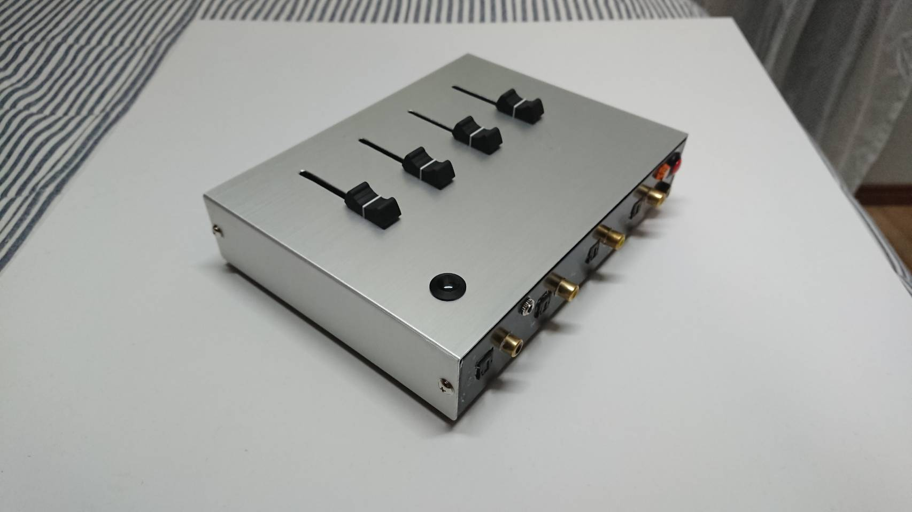
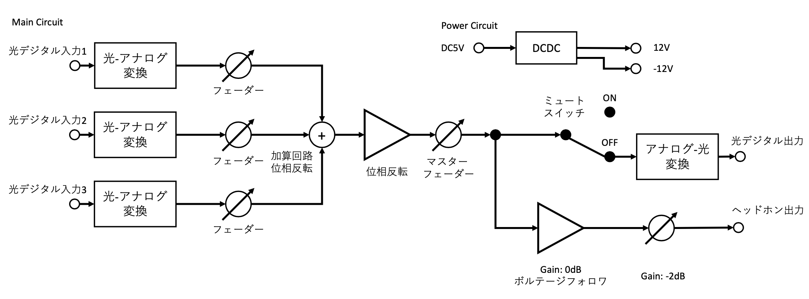

# takAVmixer

  

## 仕様

詳細仕様は非公開

回路ブロック図とインターフェイスは公開

### 概要

takAVmixerは光デジタルオーディオ用のミキサーである.

### ブロック図

  

  takAVmixer ブロック図

### インターフェイス

- 入力
  - 光デジタル入力 3ch
- 出力
  - 光デジタル出力 1ch
  - HP出力 1ch
- 操作子
  - 光デジタル入力用フェーダー x3
    - 光デジタル入力のゲインを調整(0db~-∞db)
  - マスターフェーダー x1
    - 光デジタル出力とHPのゲインを調整(0db~-∞db)
  - ミュートスイッチ
    - 光デジタル出力をミュートする
  - 電源スイッチ
    - 5V ACアダプター

## 日程

1. 2019/5/24 @電子ライダーさんと仕様共有
2. 2019/5/24-6/23 @電子ライダーさんと設計仕様作成
    - アナログ部
      - 光音声の合成は, アナログでやることに決める
        - 光→アナログ：市販品使用([LINK](https://www.amazon.co.jp/dp/B00GIHV8G4/))
        - アナログ→光：市販品使用([LINK](https://www.amazon.co.jp/dp/B00W9NBDZM/))
      - オーディオ加算回路
        - 参考([LINK](https://www.zea.jp/audio/schematic/sc_file/026.htm))
        - 入力段LPF：fc=5Hzで設計
    - ノンプログラミング
      - プログラミングの要素はなくす
        - 理由
          - 低工数・安価・短納期に対応したい
          - バグをなるべく出したくない
    - 電源：5V ACアダプター
      - 基板内部
        - 5V→+-12V
    - ケース：YM-200([LINK](http://akizukidenshi.com/catalog/g/gP-09536/))
3. 2019/6/30 @電子ライダーさん 回路図第一版完成
    - レビュー(LINE)
      - オーディオ加算回路：単電源(5V)から両電源(+-12V)に変更
      - オペアンプ周辺回路
        - 選定：4580DD
        - 電源にパスコン追加(0.1u 可能であれば 10u)
        - 負帰還に位相補償用のパスコンを追加
        - ＋入力にバイアス調整用の抵抗を追加
      - 基板：ユニバーサル→切削基板に変更
4. 2019/7/7 @電子ライダーさん 回路図第二版完成
    - 基板完成(切削) 2019/7/6
    - レビュー(対面) 2019/7/8
      - 位相補償用のパターンを追加
      - ヘッドホン出力に1Mプルダウン抵抗を追加
      - オペアンプ電源にパスコンを追加
      - 配線を極力短く修正
      - 両電源用DCDCのパスコンの位置修正
      - パスコン：リードからチップに変更
5. 2019/7/21 @電子ライダーさん 実装済み基板完成
    - ヘッドホンアウト不良：半田付けミス
6. 2019/8/5 @電子ライダーさん 報酬交渉
    - ケース組み込み完成 2019/8/6
    - @CCWO
      - 部品＋開発費:25000円(クライアントより)
    - @電子ライダーさん
      - 部品請求額：8000円
      - 開発費：17000円
      - 開発品の宣伝・記事可
7. 2019/8/12 精算
    - @電子ライダーさんから部品表受領
    - 会計の齟齬発生
      - @電子ライダーさん認識
        - 部品代：16000円
        - 開発費：25000円
        - 計：41000円
      - @CCWO認識
        - 部品代：16000円
        - 開発費：9000円
        - 計：25000円
      - LINEに証拠あり＠電子ライダーさんの認識ミス
    - 妥協案
      - クライアント
        - 部品代：15000円
        - 開発費：10000円
      - @CCWO
        - 開発費：10000円(次回も受注してくれる前提で自分が出費)
      - 計：35000円
8. 2019/8/17 検品＋受け取り
9. 2019/9/1 納品
10. 2019/9/12 修理依頼
    - 修正点1：ヘッドフォンの仕様→HPを常時接続にして、光出力をスイッチで出力切ったりできるようにする→アナログスイッチ周りの配線(論理)を変更

      現状

      |SW|Optical|HP|
      |:--|:--|:--|
      |ON|ON|OFF|
      |OFF|ON|ON|

      改良後

      |SW|Optical|HP|
      |:--|:--|:--|
      |ON|ON|ON|
      |OFF|OFF|ON|

    - 修正点2：ヘッドフォンの音量変化 ヘッドフォンの音量が出力時に下がる→ヘッドフォンの回路はボルテージフォロワで分離
    - 修正点3：ヘッドフォンの遅延 光出力がヘッドフォン出力に対して遅延している→TVとHP両方で聞くことは基本ないので非対応
    - 修正点4：光入力のドルビー対応 光入力がテレビーのドルビー形式に対応していない→TVの設定変更により対処(その代わりドルビーが使えなくなる→ドルビー対応は高い変換器を買わないとできないため断念)
11. 2019/9/16 動作確認
12. 2019/9/23 @電子ライダーさん 回路図第三版完成
    - レビュ-
      - HPのゲイン回路修正
13. 2019/10/5 @電子ライダーさん 修理引き渡し
14. 2019/10/14 @電子ライダーさん 修理完了
15. 2019/10/19 受け取り
16. 2019/10/20 再納品
17. 2020/1/13 修理依頼
    - @CCWO対応
      - 修理点1：フェーダーの接点不良
      - 修理点2：フェーダーの色・形変更
      - 修理点3：ヘッドホンの音質・音量改善
18. 2020/2/9 修理対応
    - @電子ライダーさん 回路図第四版完成(修正対応後の回路図)
    - 電源動作確認：静止電力 5V 0.18Aで+-12Vともに良好
    - フェーダー動作確認：チャンネル2,3が不良(動画に撮影)
      - 1,Main：問題はなさそう
      - 2：横方向に倒すと通電
      - 3：フェーダーがどこかの抵抗値で固まっている
      - 原因：フェーダーの穴の横幅が広すぎ遊びがあったから
      - 資料：movieフォルダに保存
    - やったこと
      - ヘッドホンの音量を調整（10kで分圧：-6dB）
      - フェーダーの取り外し
      - 注文：交換用フェーダー
    - 次回やること
      - フェーダーの取り付け
19. 2020/2/16 再注文
    - フェーダーの型番を間違えたため再注文
20. 2020/2/18 引き渡し
    - 修理：フェーダー取り付け
    - 引き渡し
21. 2020/2/23 修理
    - ヘッドホンの音量を調整(10k:2.2kで分圧：約-2~-3dB)
    - 引き渡し

## 教訓

自分が発注する側・受注する側になった気持ちで反省

- 精算関連
  - 精算部分はダブルチェックすること
  - 報酬部分(今回でいう開発費)の部分は受注側に最も影響するところなので念入りに確認すること
  - 明細を可視化して共有する
  - 開発費の内訳を作ってもらう
  - 試作の部品代を管理すること
  - 開発費を高くとれる案件をこなしていこう
- 開発関連
  - 入出力の仕様は必ず固める
  - 内部の回路の仕様は柔軟に対応する
  - レビューの記録を文章で残す
    - 指摘点→対応
  - 基板については最初に決める
    - 実装＋基板
    - 基板のみ
    - その他（切削など）
- 保守・修理関連
  - 事前に修理をするのは誰か？・修理費用を出すの誰か？修理費用は誰が見積もるか？を決める
  - 保守・メンテナンスに必要な時期・日程・工数・費用を相談すること

## 改良点

- オーディオ出力
  - ヘッドホンの音質を改善する
  - ヘッドホンのゲインをノブで調整できるようにする
- 操作子
  - フェーダーの固定部分をもう少し筐体から出す
  - フェーダーの種類を選択できるようにする

## 資料

資料は非公開

自分メモ用

- doc：設計仕様
- image：写真
- movie：フェーダーの故障状況の動画
- order：部品表
- share：共有資料
- share/190707eagle：第一版
- share/190724eagle：第二版
- share/190923eagle：第三版
- share/191015audiomixerEAGLE：第四版
- share/cad：ケース加工シミュレーション
- share/CADスクショ：ケース加工シミュレーションのスクショ

## 写真

- 内部

    

      
    

- 基板上面

    

      
    

- 基板下面

    

      
    

